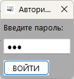
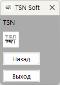

# VS2022_CPP_wxWidgets_Win2in1
Пример многооконной программы на C++ с использованием wxWidgets в Visual Studio 2022

(версия с 2 окнами в одном файле разметки и поддержкой компиляции в Linux)

**Для запуска на другом компьютере там сперва нужно установить MS Visual C++ Redistributable packages:**

*Для x32-программ:* https://aka.ms/vs/17/release/vc_redist.x86.exe

*Для x64-программ:* https://aka.ms/vs/17/release/vc_redist.x64.exe
